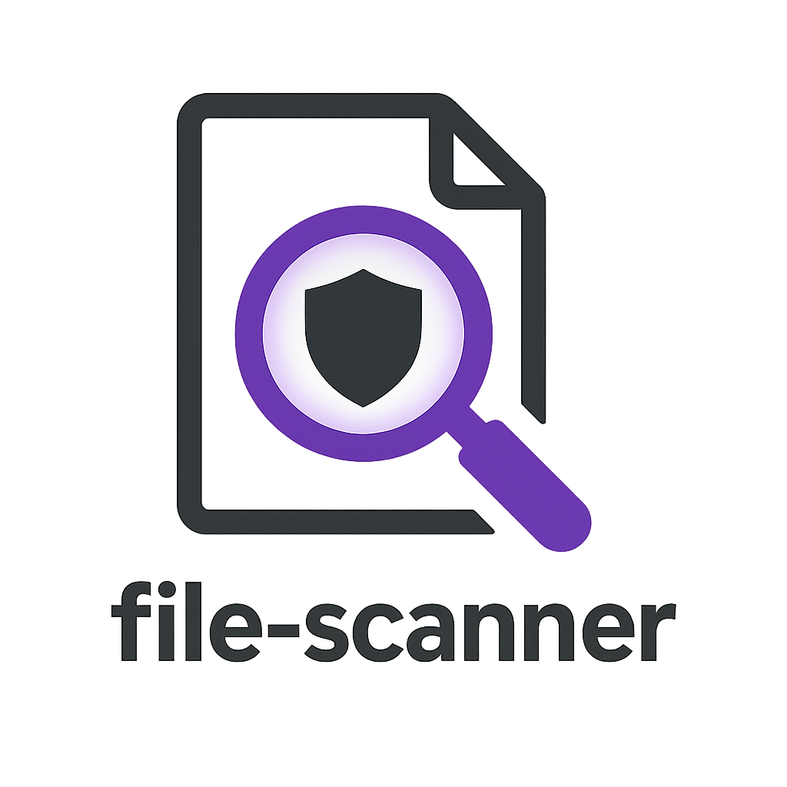

# 🔍 File Scanner



[](https://codecov.io/github/ThreatFlux/file-scanner)
[](https://github.com/ThreatFlux/file-scanner/actions)
[](https://www.rust-lang.org)
[](https://opensource.org/licenses/MIT)
[](CONTRIBUTING.md)
[](https://modelcontextprotocol.io)

**A blazing fast, modular file analysis framework for security research, malware detection,
and forensic investigation**

[Documentation](docs/) • [Installation](docs/INSTALLATION.md) • [Usage](docs/USAGE.md) •
[API](docs/API.md) • [Library Overview](LIBRARY_OVERVIEW.md) • [Migration Guide](MIGRATION_GUIDE.md) • [Contributing](CONTRIBUTING.md)

---

## 🎯 Overview

File Scanner is a high-performance, native file analysis tool written in Rust that provides deep insights
into file contents, structure, and behavior. Designed for security researchers, malware analysts, and forensic
investigators, it combines traditional static analysis with advanced pattern recognition and behavioral analysis
capabilities.

**🧩 Modular Architecture**: File Scanner is built using a collection of specialized ThreatFlux libraries, each
optimized for specific analysis tasks. This modular approach allows you to use individual components in your own
projects or integrate the full scanner into existing workflows.

### 🚀 Key Features

- **⚡ Lightning Fast** - Async hash calculations and parallel processing
- **🔐 Security Focused** - Advanced malware detection and vulnerability analysis
- **🤖 AI-Ready** - Full MCP (Model Context Protocol) integration
- **📊 Comprehensive Analysis** - From basic metadata to advanced behavioral patterns
- **🔧 Extensible** - Modular architecture for easy feature additions
- **📦 Multi-Format** - PE, ELF, Mach-O binary analysis with compiler detection

### 📚 ThreatFlux Libraries

File Scanner is powered by specialized libraries that can be used independently:

| Library | Purpose | Status |
|---------|---------|--------|
| **[threatflux-hashing](threatflux-hashing/)** | High-performance cryptographic hash calculations | ✅ Stable |
| **[threatflux-cache](threatflux-cache/)** | Flexible caching system with multiple backends | ✅ Stable |
| **[threatflux-string-analysis](threatflux-string-analysis/)** | String extraction and pattern analysis | ✅ Stable |
| **[threatflux-binary-analysis](threatflux-binary-analysis/)** | Binary format parsing (PE/ELF/Mach-O) | 🚧 Beta |
| **[threatflux-package-security](threatflux-package-security/)** | Package vulnerability and security analysis | 🚧 Beta |
| **[threatflux-threat-detection](threatflux-threat-detection/)** | Advanced threat and malware detection | 🚧 Beta |

See the [Library Overview](LIBRARY_OVERVIEW.md) for detailed comparisons and use cases.

## 🚀 Quick Start

### Full Scanner Application

```bash
# Clone and build the complete scanner
git clone https://github.com/ThreatFlux/file-scanner.git
cd file-scanner
cargo build --release

# Basic scan
./target/release/file-scanner /bin/ls

# Full analysis
./target/release/file-scanner /path/to/file --strings --hex-dump \
  --verify-signatures

# Start as MCP server
./target/release/file-scanner mcp-stdio
```

### Using Individual Libraries

```toml
# Add to your Cargo.toml
[dependencies]
threatflux-hashing = "0.1.0"
threatflux-string-analysis = "0.1.0"
```

```rust
// Example: Hash a file using threatflux-hashing
use threatflux_hashing::calculate_all_hashes;

#[tokio::main]
async fn main() -> Result<(), Box<dyn std::error::Error>> {
    let hashes = calculate_all_hashes("file.bin").await?;
    println!("SHA256: {}", hashes.sha256);
    Ok(())
}
```

See [Installation Guide](docs/INSTALLATION.md) for detailed setup instructions.

## 📖 Documentation

### Core Documentation
- **[Installation Guide](docs/INSTALLATION.md)** - Prerequisites, building, Docker support
- **[Usage Guide](docs/USAGE.md)** - Examples, CLI options, output formats
- **[Architecture](docs/ARCHITECTURE.md)** - Design, components, extending
- **[API Reference](docs/API.md)** - Rust API documentation

### Library Documentation
- **[Library Overview](LIBRARY_OVERVIEW.md)** - Complete guide to all ThreatFlux libraries
- **[Migration Guide](MIGRATION_GUIDE.md)** - Upgrading from monolithic to modular
- **[Performance Guide](PERFORMANCE_GUIDE.md)** - Optimization across all libraries
- **[Security Considerations](SECURITY_CONSIDERATIONS.md)** - Security best practices

### Integration & Deployment
- **[MCP Integration](docs/MCP.md)** - AI tool integration, configuration, API
- **[Deployment Guide](DEPLOYMENT_GUIDE.md)** - Production deployment instructions
- **[FAQ](docs/FAQ.md)** - Common questions and answers

## ✨ Core Capabilities

### File Analysis

- 📁 **Metadata** - Size, timestamps, permissions, MIME types
- 🔏 **Hashes** - MD5, SHA256, SHA512, BLAKE3
- 📝 **Strings** - ASCII/Unicode extraction with categorization
- 🔬 **Binary Analysis** - PE/ELF/Mach-O parsing
- ✍️ **Signatures** - Authenticode, GPG, macOS verification
- 🔢 **Hex Dumps** - Configurable header/footer/offset dumps

### Advanced Features

- 🎭 **Behavioral Analysis** - Anti-debugging, evasion, persistence
- 🕸️ **Call Graphs** - Function relationships, complexity metrics
- 🚨 **Vulnerability Detection** - Buffer overflows, format strings
- 🌡️ **Entropy Analysis** - Packed/encrypted section detection
- ☠️ **Threat Detection** - Malware patterns, suspicious IoCs
- 🔧 **Disassembly** - x86/x64 instruction analysis

### MCP Server

- 🤖 **AI Integration** - Works with Claude, Cursor, and other MCP clients
- 🚄 **Multiple Transports** - STDIO, HTTP, SSE support
- 🛠️ **Comprehensive Tools** - Full scanner capabilities via JSON-RPC
- 💾 **Smart Caching** - Automatic result persistence

## 🧪 Example Output

```json
{
  "file_path": "/usr/bin/ls",
  "file_size": 142848,
  "mime_type": "application/x-elf",
  "hashes": {
    "md5": "d41d8cd98f00b204e9800998ecf8427e",
    "sha256": "e3b0c44298fc1c149afbf4c8996fb92427ae41e4649b934ca495991b7852b855"
  },
  "binary_info": {
    "format": "ELF",
    "architecture": "x86_64",
    "compiler": "GCC/GNU",
    "is_stripped": false
  }
}
```

## 🤝 Contributing

We welcome contributions to both the main scanner and individual libraries! Please see our [Contributing Guidelines](CONTRIBUTING.md) for details.

```bash
# Fork, clone, and create a feature branch
git clone https://github.com/YOUR_USERNAME/file-scanner.git
cd file-scanner
git checkout -b feature/amazing-feature

# Install pre-commit hooks (recommended for developers)
pip install pre-commit
pre-commit install

# Build the entire workspace
cargo build --workspace

# Test all libraries
cargo test --workspace
cargo fmt --all
cargo clippy --workspace

# Submit a pull request
```

### Contributing to Individual Libraries

Each ThreatFlux library accepts contributions independently. See individual library README files for specific guidelines. Library contributions follow the same process but focus on the specific library directory.

## 🔒 Security

For security concerns, please see our [Security Policy](SECURITY.md) or email <security@threatflux.com>.

## 🗺️ Roadmap

See our [detailed roadmap](docs/ROADMAP.md) for planned features:

- **Q1 2025** - PE advanced analysis, YARA rule generation
- **Q2 2025** - ML classification, distributed scanning
- **Q3 2025** - Real-time monitoring, VirusTotal integration
- **Q4 2025** - Custom rules, sandbox integration

## 📄 License

This project is licensed under the MIT License - see the [LICENSE](LICENSE) file for details.

---

**[⬆ back to top](#-file-scanner)**

Made with ❤️ by [ThreatFlux](https://github.com/ThreatFlux)

[Report Bug](https://github.com/ThreatFlux/file-scanner/issues) •
[Request Feature](https://github.com/ThreatFlux/file-scanner/issues)
