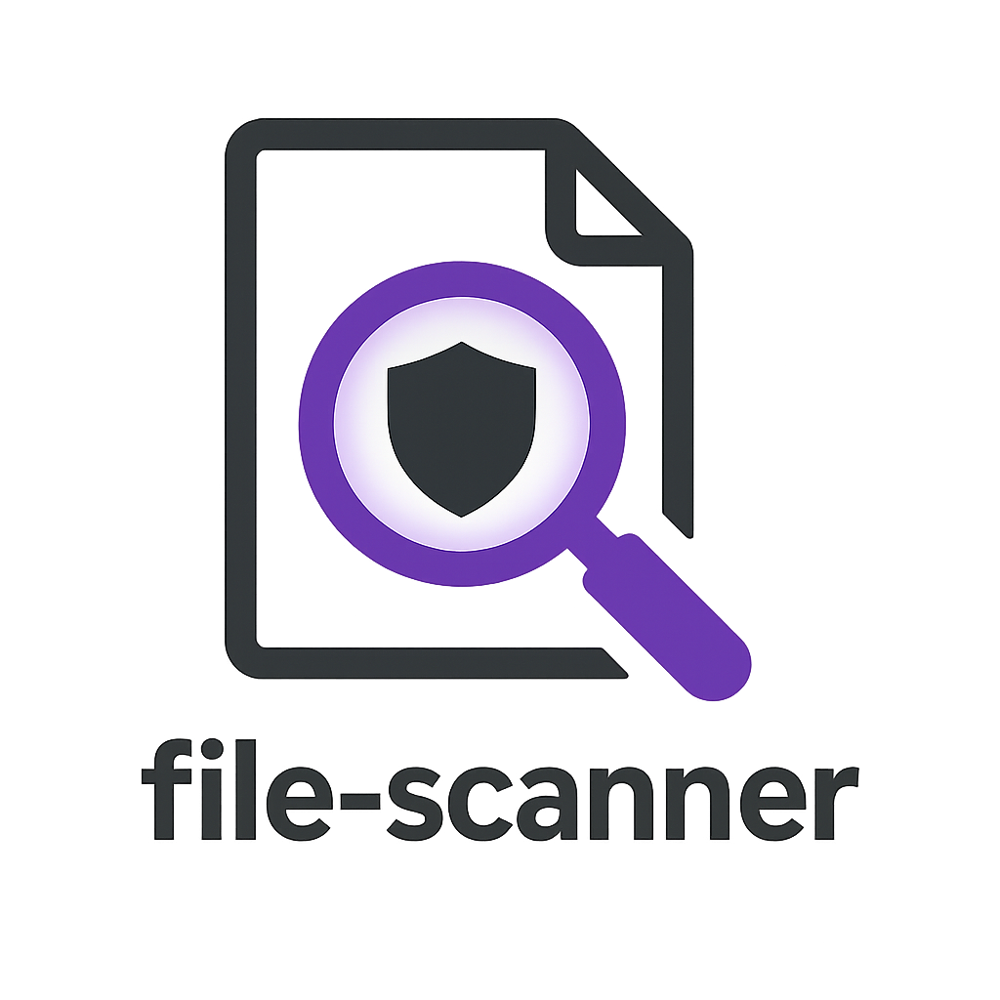

# 🔍 File Scanner



[](https://github.com/ThreatFlux/file-scanner/actions)
[](https://github.com/ThreatFlux/file-scanner/actions)
[](https://github.com/ThreatFlux/file-scanner/actions)
[](https://codecov.io/github/ThreatFlux/file-scanner)
[](https://www.rust-lang.org)
[](https://opensource.org/licenses/MIT)
[](CONTRIBUTING.md)
[](https://modelcontextprotocol.io)

**A blazing fast, modular file analysis framework for security research, malware detection, and forensic investigation**

[Documentation](docs/) • [Installation](docs/INSTALLATION.md) • [Usage](docs/USAGE.md) • [API](docs/API.md) • [Contributing](CONTRIBUTING.md)

---

## 🎯 Overview

File Scanner is a high-performance, native file analysis tool written in Rust that provides deep insights into file contents, structure, and behavior. Designed for security researchers, malware analysts, and forensic investigators, it combines traditional static analysis with advanced pattern recognition and behavioral analysis capabilities.

### 🚀 Key Features

- **⚡ Lightning Fast** - Async hash calculations and parallel processing
- **🔐 Security Focused** - Advanced malware detection and vulnerability analysis  
- **🤖 AI-Ready** - Full MCP (Model Context Protocol) integration for AI assistants
- **📊 Comprehensive Analysis** - From basic metadata to advanced behavioral patterns
- **🔧 Extensible** - Modular architecture using specialized ThreatFlux libraries
- **📦 Multi-Format** - PE, ELF, Mach-O binary analysis with compiler detection
- **🔍 Package Security** - NPM, Python, and Java package vulnerability scanning
- **📈 Performance Tracking** - Continuous benchmarking with GitHub Pages dashboard

## 📚 Powered by ThreatFlux Libraries

File Scanner leverages specialized libraries available on crates.io:

| Library | Version | Purpose | crates.io |
|---------|---------|---------|-----------|
| **threatflux-hashing** | 1.7.0 | High-performance cryptographic hash calculations | [](https://crates.io/crates/threatflux-hashing) |
| **threatflux-string-analysis** | 0.2.2 | String extraction and pattern analysis | [](https://crates.io/crates/threatflux-string-analysis) |
| **threatflux-cache** | 0.2.0 | Flexible caching system with multiple backends | [](https://crates.io/crates/threatflux-cache) |
| **threatflux-binary-analysis** | 0.3.0 | Binary format parsing (PE/ELF/Mach-O) | [](https://crates.io/crates/threatflux-binary-analysis) |

## 🚀 Quick Start

### Installation

```bash
# Clone and build
git clone https://github.com/ThreatFlux/file-scanner.git
cd file-scanner
cargo build --release --locked

# Or install directly from source
cargo install --path . --locked
```

[GitHub Releases](https://github.com/ThreatFlux/file-scanner/releases) carry
prebuilt binaries with SHA-256 checksums; releases cut by the release workflow
cover Linux (x86_64, arm64), macOS (arm64, x86_64) and Windows (x86_64) and
attach a CycloneDX SBOM. Container images are published to
`ghcr.io/threatflux/file-scanner`.

#### From crates.io

On crates.io the crate is named `threatflux-file-scanner`, because the
`file-scanner` name belongs to an unrelated crate (`cargo install file-scanner`
does not install this project). It installs the same `file-scanner` binary:

```bash
cargo install threatflux-file-scanner --locked
```

Until [crates.io](https://crates.io/crates/threatflux-file-scanner) lists a
release, install from source or GitHub Releases instead. As a library, add
`threatflux-file-scanner` to `Cargo.toml` and import it as `file_scanner`.

The crates.io build resolves the upstream YARA-X 1.21.0 release, which pins
Wasmtime 45. Release binaries and container images build from this repository
with the vendored YARA-X security patch (Wasmtime 49.0.2); see
[vendor/README.md](vendor/README.md) for why the crates.io build is not exposed
to the Wasmtime advisories that patch addresses.

### Basic Usage

```bash
# Simple file scan
file-scanner /bin/ls

# Comprehensive analysis
file-scanner /path/to/file --all

# Specific analyses
file-scanner file.exe --strings --hex-dump --verify-signatures

# Output formats
file-scanner file.bin --format json > analysis.json
file-scanner file.bin --format yaml
```

### MCP Server Mode

```bash
# Start as MCP server (for AI assistants)
file-scanner mcp-stdio

# HTTP server mode
file-scanner mcp-http --port 3000

# Server-Sent Events mode
file-scanner mcp-sse --port 3000
```

## ✨ Core Capabilities

### File Analysis Features

#### Basic Analysis
- **Metadata** - Size, timestamps, permissions, MIME types, magic bytes
- **Hashes** - MD5, SHA256, SHA512, BLAKE3 (concurrent calculation)
- **Strings** - ASCII/Unicode extraction with categorization and entropy analysis
- **Hex Dump** - Configurable header/footer/offset dumps with pattern highlighting

#### Binary Analysis
- **Format Parsing** - PE, ELF, Mach-O with section analysis
- **Compiler Detection** - GCC, MSVC, Clang, Rust, Go identification
- **Import/Export Analysis** - Function imports, library dependencies
- **Digital Signatures** - Authenticode, GPG, macOS code signing verification

#### Advanced Analysis
- **Behavioral Patterns** - Anti-debugging, evasion techniques, persistence mechanisms
- **Control Flow** - Function call graphs, complexity metrics, code reachability
- **Vulnerability Detection** - Buffer overflows, format strings, unsafe functions
- **Entropy Analysis** - Packed/encrypted section detection, randomness assessment
- **Threat Detection** - Malware patterns, suspicious IoCs, YARA rule matching

#### Package Security
- **NPM Analysis** - Vulnerability scanning, typosquatting detection, supply chain risks
- **Python Analysis** - PyPI package security, malicious code patterns, dependency risks
- **Java Analysis** - JAR/WAR inspection, CVE checking, manifest analysis

### MCP Tools

The MCP server provides three powerful tools for AI assistants:

1. **`analyze_file`** - Comprehensive file analysis with configurable options
2. **`llm_analyze_file`** - LLM-optimized analysis with token limits
3. **`yara_scan_file`** - Custom YARA rule scanning with recursive directory support

## 📊 Example Output

```json
{
  "file_path": "/usr/bin/ls",
  "file_size": 142848,
  "mime_type": "application/x-elf",
  "hashes": {
    "md5": "d41d8cd98f00b204e9800998ecf8427e",
    "sha256": "e3b0c44298fc1c149afbf4c8996fb92427ae41e4649b934ca495991b7852b855",
    "blake3": "af1349b9f5f9a1a6a0404dea36dcc9499bcb25c9adc112b7cc9a93cae41f3262"
  },
  "binary_info": {
    "format": "ELF",
    "architecture": "x86_64",
    "compiler": "GCC 11.2.0",
    "is_stripped": false,
    "sections": [
      {
        "name": ".text",
        "size": 89432,
        "entropy": 5.84,
        "characteristics": ["CODE", "EXECUTABLE"]
      }
    ]
  },
  "strings": {
    "total_count": 1847,
    "categories": {
      "urls": 12,
      "paths": 234,
      "commands": 45,
      "suspicious": 3
    }
  },
  "threats": {
    "risk_level": "Low",
    "indicators": []
  }
}
```

## 🛠️ Development

### Building from Source

```bash
# Full build with all features
cargo build --release --all-features

# Development build with optimizations
cargo build --profile dev-opt

# Run tests
cargo test --workspace

# Run benchmarks
cargo bench
```

### Project Structure

```
file-scanner/
├── src/
│   ├── main.rs              # CLI interface
│   ├── metadata.rs          # File metadata extraction
│   ├── hash.rs             # Cryptographic hashing
│   ├── strings.rs          # String extraction
│   ├── binary_parser.rs    # Binary format parsing
│   ├── signature.rs        # Digital signatures
│   ├── mcp/               # MCP server implementation
│   └── ...                # Additional analyzers
├── benches/               # Performance benchmarks
├── tests/                # Integration tests
└── docs/                 # Documentation
```

### CI/CD Pipeline

The project uses comprehensive GitHub Actions workflows:

- **CI** - Build, test, and lint across Linux, macOS, Windows
- **Security Audit** - Dependency scanning, SBOM generation, vulnerability checks
- **Performance Benchmarks** - Continuous performance tracking with history
- **Auto Release** - Automated versioning and release management
- **Docker** - Multi-platform container builds

## 🤝 Contributing

Development uses Rust **1.99.0**; the consumer MSRV remains **1.97.1**.
The root workspace and the separate `threatflux-package-security` crate are both
checked by `make ci-local`. Workflow validation uses actionlint 1.7.12 and
yamllint 1.38.0; set `ACTIONLINT_BIN` and `YAMLLINT_BIN` for tools outside `PATH`.

We welcome contributions! Please see our [Contributing Guidelines](CONTRIBUTING.md) for details.

```bash
# Fork and clone
git clone https://github.com/YOUR_USERNAME/file-scanner.git
cd file-scanner

# Create feature branch
git checkout -b feature/amazing-feature

# Install repository hooks
make hooks-install

# Make changes and run the full local gate
make ci-local

# Submit pull request
```

## 🔒 Security

Source builds and Docker images use a documented temporary YARA-X patch with
patched stable Wasmtime. Cargo does not propagate this root override to published
library consumers; see the [patch provenance and distribution limits](vendor/README.md).
The existing RSA advisory exception remains limited to public-key verification.

For security vulnerabilities, please see our [Security Policy](SECURITY.md) or email security@threatflux.com.

## 🗺️ Roadmap

### Current Version: v0.2.1

### Upcoming Features

- **v0.3.0** (Q1 2025)
  - Advanced PE analysis with resource extraction
  - YARA rule generation from samples
  - Memory dump analysis
  
- **v0.4.0** (Q2 2025)
  - Machine learning malware classification
  - Distributed scanning capabilities
  - Real-time file monitoring
  
- **v0.5.0** (Q3 2025)
  - VirusTotal integration
  - Sandbox execution reports
  - Custom rule engine

## 📈 Performance

The scanner is optimized for speed and efficiency:

- Concurrent hash calculations using tokio
- Memory-mapped file I/O for large files
- Intelligent caching of analysis results
- Parallel string extraction
- Optimized binary parsing

Benchmark results are continuously tracked at: https://threatflux.github.io/file-scanner/

## 🐳 Docker Support

```bash
# Pull the published image (or build it locally with: docker build -t ghcr.io/threatflux/file-scanner .)
docker pull ghcr.io/threatflux/file-scanner:latest

# Run container
docker run --rm -v /path/to/files:/data:ro ghcr.io/threatflux/file-scanner /data/file

# MCP server mode
docker run --rm -p 3000:3000 ghcr.io/threatflux/file-scanner mcp-http --port 3000
```

The runtime image is distroless Debian 13 (`gcr.io/distroless/cc-debian13:nonroot`):
it runs as an unprivileged user and contains no shell or package manager.

## 📄 License

This project is licensed under the MIT License - see the [LICENSE](LICENSE) file for details.

## 🙏 Acknowledgments

- Built with Rust and the amazing Rust ecosystem
- MCP SDK by Anthropic
- Security patterns from MITRE ATT&CK
- Binary parsing powered by goblin and object crates

---

**[⬆ back to top](#-file-scanner)**

Made with ❤️ by [ThreatFlux](https://github.com/ThreatFlux)

[Report Bug](https://github.com/ThreatFlux/file-scanner/issues) • [Request Feature](https://github.com/ThreatFlux/file-scanner/issues) • [Documentation](https://github.com/ThreatFlux/file-scanner/wiki)