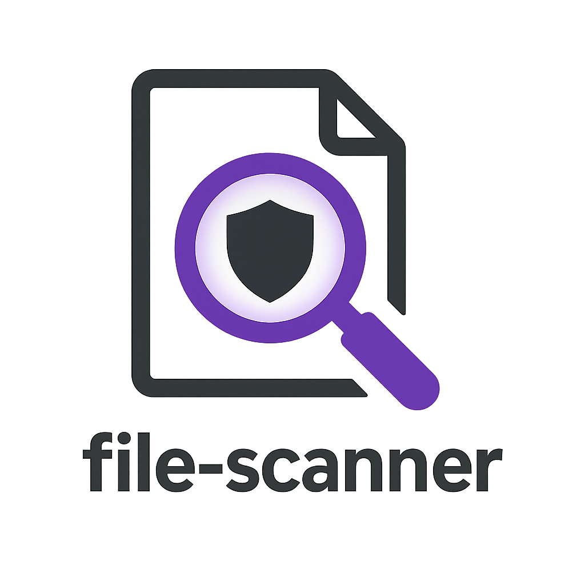

# 🔍 File Scanner



[](https://codecov.io/github/ThreatFlux/file-scanner)
[](https://www.rust-lang.org)
[](https://opensource.org/licenses/MIT)
[](CONTRIBUTING.md)
[](https://modelcontextprotocol.io)

**A blazing fast, comprehensive file analysis framework for security research, malware detection,
and forensic investigation**

[Documentation](docs/) • [Installation](docs/INSTALLATION.md) • [Usage](docs/USAGE.md) •
[API](docs/API.md) • [Contributing](CONTRIBUTING.md)

---

## 🎯 Overview

File Scanner is a high-performance, native file analysis tool written in Rust that provides deep insights
into file contents, structure, and behavior. Designed for security researchers, malware analysts, and forensic
investigators, it combines traditional static analysis with advanced pattern recognition and behavioral analysis
capabilities.

### 🚀 Key Features

- **⚡ Lightning Fast** - Async hash calculations and parallel processing
- **🔐 Security Focused** - Advanced malware detection and vulnerability analysis
- **🤖 AI-Ready** - Full MCP (Model Context Protocol) integration
- **📊 Comprehensive Analysis** - From basic metadata to advanced behavioral patterns
- **🔧 Extensible** - Modular architecture for easy feature additions
- **📦 Multi-Format** - PE, ELF, Mach-O binary analysis with compiler detection

## 🚀 Quick Start

```bash
# Clone and build
git clone https://github.com/ThreatFlux/file-scanner.git
cd file-scanner
cargo build --release

# Basic scan
./target/release/file-scanner /bin/ls

# Full analysis
./target/release/file-scanner /path/to/file --strings --hex-dump \
  --verify-signatures

# Start as MCP server
./target/release/file-scanner mcp-stdio
```

See [Installation Guide](docs/INSTALLATION.md) for detailed setup instructions.

## 📖 Documentation

- **[Installation Guide](docs/INSTALLATION.md)** - Prerequisites, building, Docker support
- **[Usage Guide](docs/USAGE.md)** - Examples, CLI options, output formats
- **[MCP Integration](docs/MCP.md)** - AI tool integration, configuration, API
- **[Architecture](docs/ARCHITECTURE.md)** - Design, components, extending
- **[API Reference](docs/API.md)** - Rust API documentation
- **[Performance](docs/PERFORMANCE.md)** - Benchmarks, optimization tips
- **[FAQ](docs/FAQ.md)** - Common questions and answers

## ✨ Core Capabilities

### File Analysis

- 📁 **Metadata** - Size, timestamps, permissions, MIME types
- 🔏 **Hashes** - MD5, SHA256, SHA512, BLAKE3
- 📝 **Strings** - ASCII/Unicode extraction with categorization
- 🔬 **Binary Analysis** - PE/ELF/Mach-O parsing
- ✍️ **Signatures** - Authenticode, GPG, macOS verification
- 🔢 **Hex Dumps** - Configurable header/footer/offset dumps

### Advanced Features

- 🎭 **Behavioral Analysis** - Anti-debugging, evasion, persistence
- 🕸️ **Call Graphs** - Function relationships, complexity metrics
- 🚨 **Vulnerability Detection** - Buffer overflows, format strings
- 🌡️ **Entropy Analysis** - Packed/encrypted section detection
- ☠️ **Threat Detection** - Malware patterns, suspicious IoCs
- 🔧 **Disassembly** - x86/x64 instruction analysis

### MCP Server

- 🤖 **AI Integration** - Works with Claude, Cursor, and other MCP clients
- 🚄 **Multiple Transports** - STDIO, HTTP, SSE support
- 🛠️ **Comprehensive Tools** - Full scanner capabilities via JSON-RPC
- 💾 **Smart Caching** - Automatic result persistence

## 🧪 Example Output

```json
{
  "file_path": "/usr/bin/ls",
  "file_size": 142848,
  "mime_type": "application/x-elf",
  "hashes": {
    "md5": "d41d8cd98f00b204e9800998ecf8427e",
    "sha256": "e3b0c44298fc1c149afbf4c8996fb92427ae41e4649b934ca495991b7852b855"
  },
  "binary_info": {
    "format": "ELF",
    "architecture": "x86_64",
    "compiler": "GCC/GNU",
    "is_stripped": false
  }
}
```

## 🤝 Contributing

We welcome contributions! Please see our [Contributing Guidelines](CONTRIBUTING.md) for details.

```bash
# Fork, clone, and create a feature branch
git clone https://github.com/YOUR_USERNAME/file-scanner.git
cd file-scanner
git checkout -b feature/amazing-feature

# Install pre-commit hooks (recommended for developers)
# This ensures code quality checks run automatically before commits
pip install pre-commit
pre-commit install

# Make changes and test
cargo test
cargo fmt
cargo clippy

# Submit a pull request
```

## 🔒 Security

For security concerns, please see our [Security Policy](SECURITY.md) or email <security@threatflux.com>.

## 🗺️ Roadmap

See our [detailed roadmap](docs/ROADMAP.md) for planned features:

- **Q1 2025** - PE advanced analysis, YARA rule generation
- **Q2 2025** - ML classification, distributed scanning
- **Q3 2025** - Real-time monitoring, VirusTotal integration
- **Q4 2025** - Custom rules, sandbox integration

## 📄 License

This project is licensed under the MIT License - see the [LICENSE](LICENSE) file for details.

---

**[⬆ back to top](#-file-scanner)**

Made with ❤️ by [ThreatFlux](https://github.com/ThreatFlux)

[Report Bug](https://github.com/ThreatFlux/file-scanner/issues) •
[Request Feature](https://github.com/ThreatFlux/file-scanner/issues)
